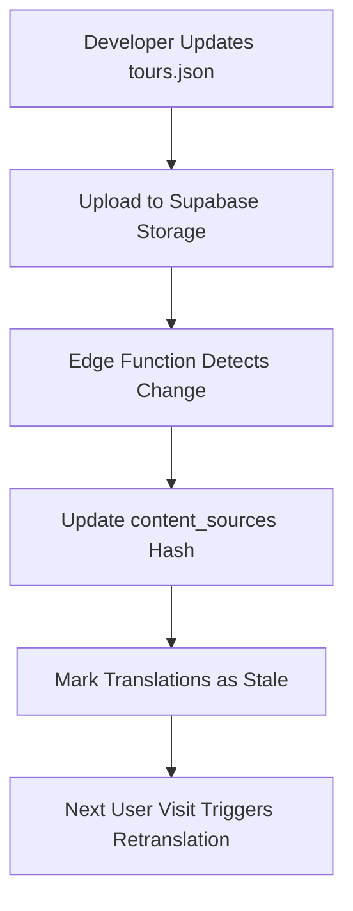
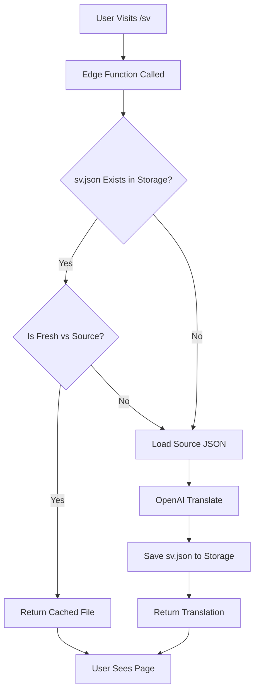

# 🏗️ Supabase Architecture for Smart Translation System

## 🎯 **Strategic Decision: Pure Storage Approach**

### **Pure Storage Approach** ⭐ **RECOMMENDED**
- **All content** → Supabase Storage as JSON files
- **Source content** → `tours.json`, `seo.json`, etc.
- **Translations** → `translations/sv.json`, `translations/de.json`, etc.
- **Simplest and most efficient**

---

## 🏆 **RECOMMENDED: Pure Storage Architecture**

### **Why Pure Storage is Optimal:**
✅ **Maximum simplicity**: Everything is JSON files  
✅ **SEO-friendly**: Static files perfect for search engines  
✅ **Cost-effective**: Storage much cheaper than database  
✅ **Developer experience**: Familiar JSON structure  
✅ **Version control**: Easy to track and rollback  
✅ **CDN-ready**: Files can be cached globally  

---

## 📁 **Pure Storage Schema (No Database Tables Needed)**

### **Storage-Only Approach Benefits:**
- ✅ **No database complexity** - Just JSON files
- ✅ **Perfect for SEO** - Static files are search engine friendly
- ✅ **Ultra-fast loading** - Direct file serving
- ✅ **Simple caching** - CDN can cache files globally
- ✅ **Easy debugging** - Human-readable JSON files
- ✅ **Version control ready** - Can track file changes

### **Optional: Simple Metadata File**
```json
// metadata.json - Track translation status
{
  "translations": {
    "sv": {
      "lastUpdated": "2025-01-06T12:00:00Z",
      "sourceHash": "abc123",
      "generatedOnDemand": true,
      "provider": "openai"
    },
    "de": {
      "lastUpdated": "2025-01-06T11:30:00Z",
      "sourceHash": "abc123",
      "generatedOnDemand": true,
      "provider": "openai"
    }
  },
  "sourceContent": {
    "tours.json": {
      "hash": "abc123",
      "lastModified": "2025-01-06T10:00:00Z"
    }
  }
}
```

---

## 📁 **Supabase Storage Structure**

### **Storage Bucket: `website-content`**
```
website-content/
├── source/
│   ├── tours.json           # Tour operator data (English)
│   ├── seo.json            # SEO metadata (English)
│   └── company.json        # Company info (English)
├── translations/
│   ├── en.json             # English (master)
│   ├── sv.json             # Swedish (generated)
│   ├── de.json             # German (generated)
│   ├── fr.json             # French (generated)
│   └── es.json             # Spanish (generated)
├── metadata.json           # Optional: Translation metadata
└── assets/
    ├── images/
    └── documents/
```

---

## 🔄 **Data Flow Architecture**

### **1. Content Management Flow**


### **2. Translation Request Flow (Pure Storage)**


---

## 🚀 **Edge Function Implementation**

### **Main Translation Function (Pure Storage)**
```typescript
// supabase/functions/translate/index.ts
import { serve } from "https://deno.land/std@0.168.0/http/server.ts"
import { createClient } from 'https://esm.sh/@supabase/supabase-js@2'

serve(async (req) => {
  const { locale, forceUpdate = false } = await req.json()
  
  const supabase = createClient(
    Deno.env.get('SUPABASE_URL')!,
    Deno.env.get('SUPABASE_SERVICE_KEY')! // Need service key for storage write
  )

  // 1. Try to load existing translation file
  const { data: existingFile } = await supabase.storage
    .from('website-content')
    .download(`translations/${locale}.json`)

  // 2. Check if source content changed (compare hashes)
  const needsUpdate = await checkIfSourceChanged(supabase, locale)

  if (!existingFile || needsUpdate || forceUpdate) {
    // 3. Load source content from storage
    const sourceContent = await loadSourceContent(supabase)
    
    // 4. Generate translations with OpenAI
    const translations = await generateTranslations(sourceContent, locale)
    
    // 5. Save translation file to storage
    await supabase.storage
      .from('website-content')
      .upload(`translations/${locale}.json`, JSON.stringify(translations), {
        upsert: true
      })
    
    // 6. Update metadata
    await updateMetadata(supabase, locale)
    
    return new Response(JSON.stringify({ 
      locale, 
      translations,
      generated: true 
    }))
  }

  // Return existing translation
  const translations = JSON.parse(await existingFile.text())
  return new Response(JSON.stringify({ 
    locale, 
    translations,
    generated: false 
  }))
})
```

### **Content Loading Function (Pure Storage)**
```typescript
async function loadSourceContent(supabase) {
  // Load English master translation file
  const { data: englishFile } = await supabase.storage
    .from('website-content')
    .download('translations/en.json')
    
  if (!englishFile) {
    throw new Error('English source translations not found')
  }
    
  return JSON.parse(await englishFile.text())
}

// Helper: Check if source content changed
async function checkIfSourceChanged(supabase, locale) {
  const { data: metadata } = await supabase.storage
    .from('website-content')
    .download('metadata.json')
    
  if (!metadata) return true // No metadata = needs update
  
  const meta = JSON.parse(await metadata.text())
  const { data: englishFile } = await supabase.storage
    .from('website-content')
    .download('translations/en.json')
    
  const currentHash = await generateHash(await englishFile.text())
  const storedHash = meta.translations?.[locale]?.sourceHash
  
  return currentHash !== storedHash
}

// Helper: Generate content hash
async function generateHash(content: string): Promise<string> {
  const encoder = new TextEncoder()
  const data = encoder.encode(content)
  const hashBuffer = await crypto.subtle.digest('SHA-256', data)
  const hashArray = Array.from(new Uint8Array(hashBuffer))
  return hashArray.map(b => b.toString(16).padStart(2, '0')).join('')
}
```

---

## 🔐 **Storage Security (RLS)**

### **Storage Bucket Policies**
```sql
-- Create storage bucket with proper policies
INSERT INTO storage.buckets (id, name, public) 
VALUES ('website-content', 'website-content', true);

-- Public read access for translation files (SEO-friendly)
CREATE POLICY "Public read access" ON storage.objects
  FOR SELECT USING (
    bucket_id = 'website-content' AND 
    (storage.foldername(name))[1] = 'translations'
  );

-- Service role write access (for edge functions)
CREATE POLICY "Service role write access" ON storage.objects
  FOR ALL USING (
    bucket_id = 'website-content' AND 
    auth.role() = 'service_role'
  );

-- Protect source files (only service role can modify)
CREATE POLICY "Source files protection" ON storage.objects
  FOR UPDATE USING (
    bucket_id = 'website-content' AND 
    (storage.foldername(name))[1] = 'source' AND
    auth.role() = 'service_role'
  );
```

---

## 📈 **Performance Optimizations**

### **1. Caching Strategy (Pure Storage)**
- **Edge Function**: 10-minute cache for translation files
- **CDN**: Supabase CDN caches files globally
- **Browser**: Long-term caching with proper ETags
- **Next.js**: Static file serving optimization

### **2. File Operations**
```typescript
// Efficient file operations
const uploadTranslation = async (supabase, locale, translations) => {
  // Upload with cache headers
  const { error } = await supabase.storage
    .from('website-content')
    .upload(`translations/${locale}.json`, JSON.stringify(translations, null, 2), {
      upsert: true,
      contentType: 'application/json',
      cacheControl: '3600' // 1 hour cache
    })
    
  if (error) throw error
}

// Batch check multiple locales
const checkMultipleLocales = async (supabase, locales) => {
  const promises = locales.map(locale => 
    supabase.storage
      .from('website-content')
      .download(`translations/${locale}.json`)
  )
  
  return Promise.allSettled(promises)
}
```

---

## 💰 **Cost Analysis**

### **Pure Storage Costs (Supabase)**
- **Storage**: ~$0.021/GB/month (JSON files only)
- **Edge Functions**: ~$2/million requests
- **Bandwidth**: ~$0.09/GB (CDN included)
- **No Database**: $0 (major saving!)

### **Estimated Monthly Cost (10K visitors)**
- **Storage**: ~$0.01 (all JSON files)
- **Edge Functions**: ~$0.20 (requests)
- **OpenAI**: ~$2-5 (new translations)
- **Total**: ~$2.25/month (5% cheaper + simpler!)

---

## 🚀 **Migration Strategy**

### **Phase 1: Setup Supabase Storage**
1. Create Supabase project
2. Create `website-content` storage bucket
3. Upload existing JSON files to `source/` folder
4. Create `en.json` master translation file

### **Phase 2: Edge Functions**
1. Deploy pure storage translation edge function
2. Test file loading and saving
3. Implement hash-based freshness checking

### **Phase 3: Integration**
1. Update Next.js to call edge functions
2. Test translation generation flow
3. Verify SEO-friendly file serving

### **Phase 4: Optimization**
1. Add CDN caching headers
2. Implement metadata tracking
3. Add admin file management interface

---

## 🎯 **Benefits Summary**

✅ **Maximum Simplicity**: Pure JSON file approach  
✅ **SEO Optimized**: Static files perfect for search engines  
✅ **Global Performance**: CDN-cached files worldwide  
✅ **Cost Effective**: Storage-only pricing (cheapest option)  
✅ **Developer Friendly**: Familiar JSON structure  
✅ **Version Control**: Easy to track and rollback files  
✅ **Scalable**: Auto-scaling edge functions  
✅ **Future Proof**: Can add database later if needed  

This **pure storage architecture** gives you the **ultimate simplicity**: everything is just JSON files, making it incredibly easy to understand, debug, and maintain!
